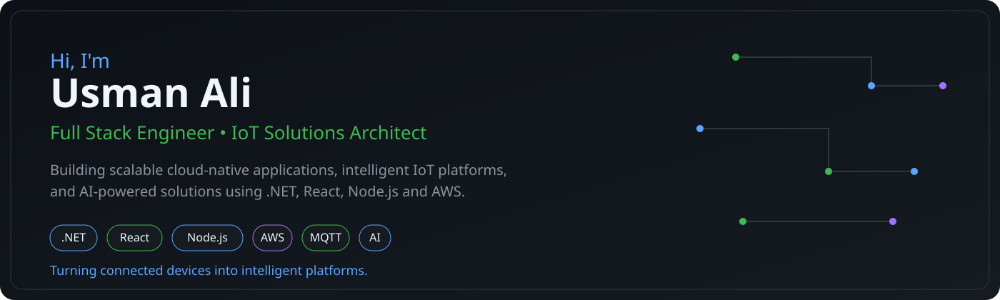

<!-- ====================================================== -->
<!-- HERO -->
<!-- ====================================================== -->

  

<h1 align="center">
Hi 👋, I'm <strong>Usman Ali</strong>
</h1>

<h3 align="center">
Full Stack Engineer • IoT Solutions Architect
</h3>

Building scalable cloud-native applications, enterprise IoT platforms, and AI-powered solutions using modern Microsoft, JavaScript, and Cloud technologies.

---
