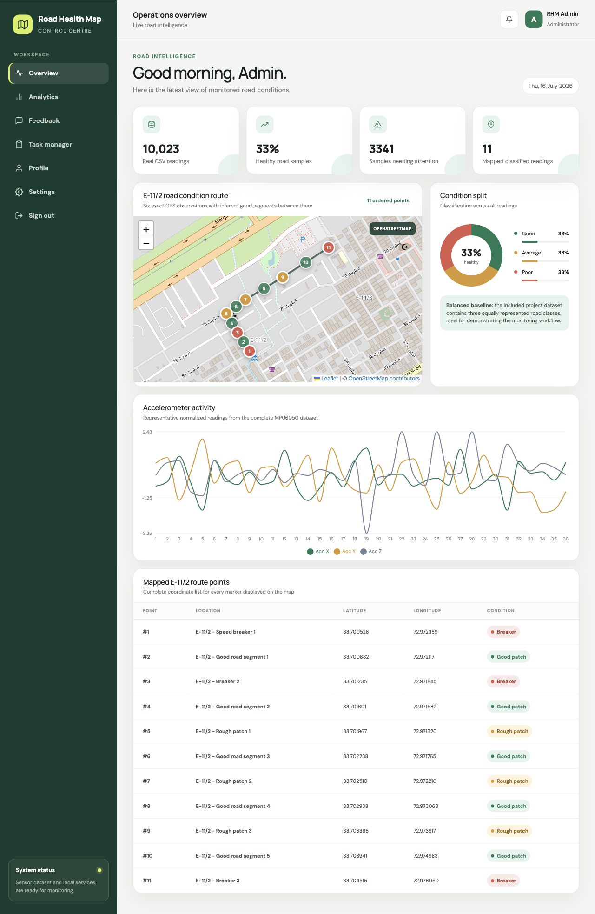
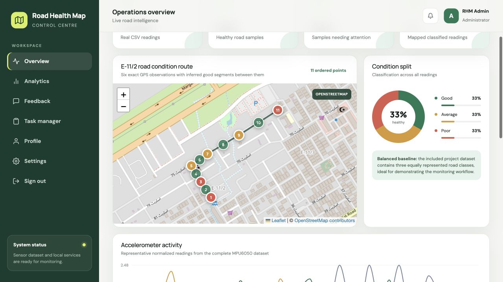
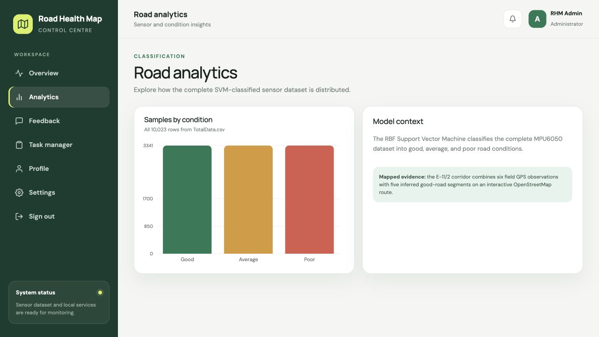
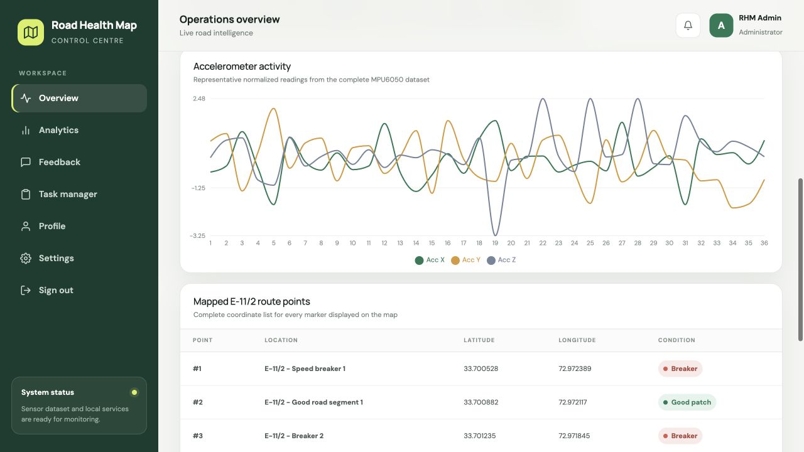
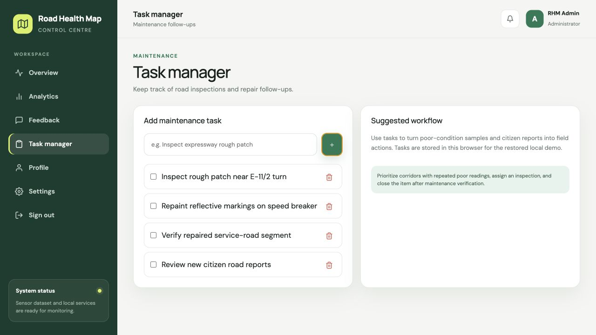
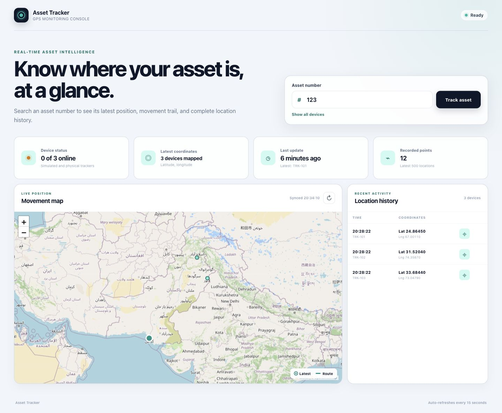
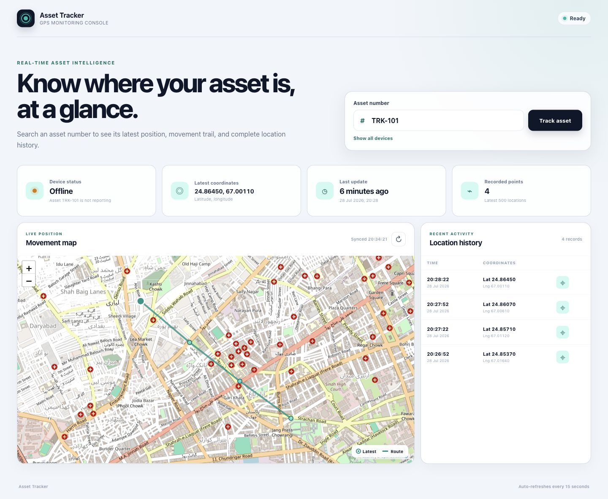
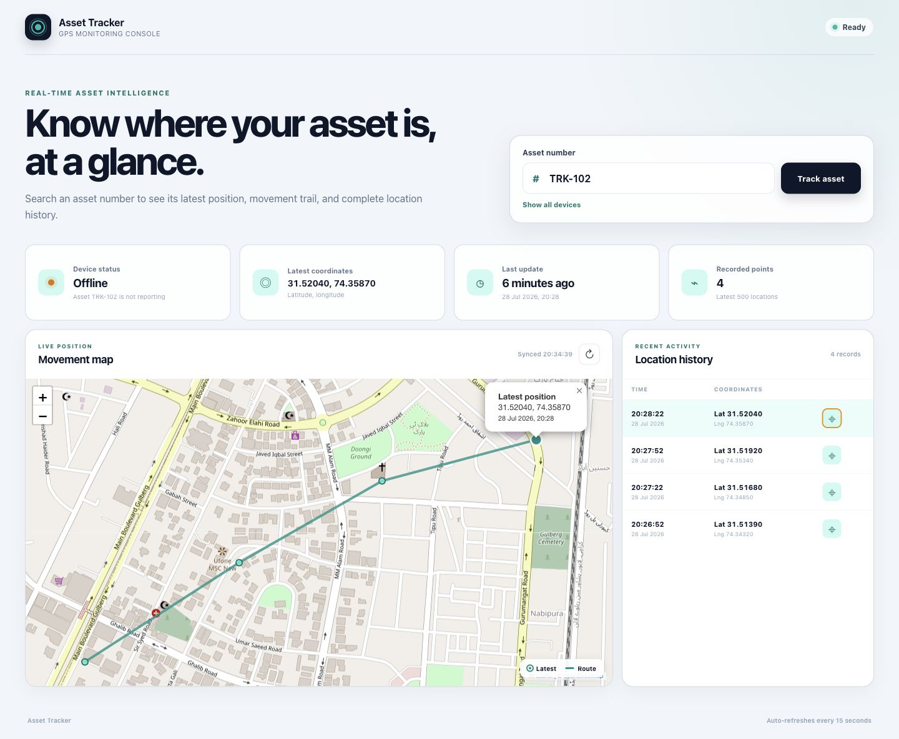

<!-- ====================================================== -->
<!-- HERO -->
<!-- ====================================================== -->

  

<h1 align="center">
Hi 👋, I'm <strong>Usman Ali</strong>
</h1>

<h3 align="center">
Full Stack Engineer • IoT Solutions Architect
</h3>

Building scalable cloud-native applications, enterprise IoT platforms, and AI-powered solutions using modern Microsoft, JavaScript, and Cloud technologies.

---
<!-- ====================================================== -->
<!-- ABOUT ME -->
<!-- ====================================================== -->

# 👨‍💻 About Me

<table>
<tr>

<td width="65%" valign="top">

### Building Modern Software

I'm a **Full Stack Engineer** with **8+ years of experience** building scalable web applications, enterprise platforms, and cloud-native solutions.

My expertise spans the complete software development lifecycle—from designing user-friendly frontends to building secure APIs, cloud infrastructure, and IoT platforms.

I enjoy solving complex engineering challenges and creating software that is reliable, maintainable, and ready for production.

</td>

<td width="35%" valign="top">

### Quick Facts

- 💼 8+ Years Experience
- 🌍 Based in Pakistan
- 🌐 Remote-First Engineer
- ☁ Cloud-Native Development
- 🔌 IoT Platform Development
- 🤖 AI Integration
- 🚀 Continuous Learner

</td>

</tr>
</table>

---

<!-- ====================================================== -->
<!-- CURRENT FOCUS -->
<!-- ====================================================== -->

# 🚀 Current Focus

<table>
<tr>

<td width="50%" valign="top">

### 🔭 Currently Building

- Enterprise IoT Platforms
- Cloud-native Web Applications
- AI-powered Business Solutions
- Microservices Architecture
- Secure REST APIs
- Real-time Monitoring Dashboards

</td>

<td width="50%" valign="top">

### 🌱 Currently Learning

- AI Agents & Autonomous Workflows
- LangGraph & Multi-Agent Systems
- Advanced AWS Services
- Event-Driven Architecture
- Kubernetes & Container Orchestration
- Platform Engineering

</td>

</tr>
</table>

---

# 💼 What I Deliver

<table>

<tr>

<td align="center" width="33%">

### 🌐

### Enterprise Web Apps

Scalable web applications using **ASP.NET Core**, **React**, **Angular**, and **Node.js**.

</td>

<td align="center" width="33%">

### ☁️

### Cloud Solutions

Modern cloud-native applications deployed on AWS with secure, scalable architecture.

</td>

<td align="center" width="33%">

### 🔌

### IoT Platforms

Connected device platforms featuring MQTT, telemetry, dashboards, automation, and analytics.

</td>

</tr>

</table>

---

<!-- ====================================================== -->
<!-- TECH STACK -->
<!-- ====================================================== -->

# 🛠️ Tech Stack

<table>

<tr>

<td valign="top" width="50%">

### 💻 Frontend

</td>

<td valign="top" width="50%">

### ⚙️ Backend

</td>

</tr>

<tr>

<td valign="top">

### 🗄️ Database

</td>

<td valign="top">

### ☁️ Cloud & DevOps

</td>

</tr>

<tr>

<td valign="top">

### 🔌 IoT

- MQTT
- REST APIs
- WebSockets
- Telemetry
- Device Management
- Real-time Monitoring

</td>

<td valign="top">

### 🤖 AI & Productivity

- OpenAI API
- LangChain
- LangGraph
- AI Agents
- Prompt Engineering
- GitHub Copilot

</td>

</tr>

</table>

---

<!-- ====================================================== -->
<!-- IOT PLATFORM EXPERTISE -->
<!-- ====================================================== -->

# 🌐 IoT Platform Expertise

Designing secure, scalable, and cloud-native IoT platforms that connect devices, process real-time data, and deliver actionable insights.

<table>

<tr>

<td width="33%" valign="top">

### 📡 Connectivity

- MQTT
- HTTP / HTTPS
- REST APIs
- WebSockets
- TCP/IP
- TLS / SSL

</td>

<td width="33%" valign="top">

### 📱 Device Management

- Device Provisioning
- Device Registration
- Firmware Updates
- Remote Configuration
- Health Monitoring
- Device Lifecycle

</td>

<td width="33%" valign="top">

### 📊 Data Processing

- Real-Time Telemetry
- Event Streaming
- Data Validation
- Rules Engine
- Alerts & Notifications
- Analytics Pipelines

</td>

</tr>

<tr>

<td valign="top">

### ☁️ Cloud Integration

- AWS
- Azure
- Serverless APIs
- Cloud Storage
- Message Queues
- Microservices

</td>

<td valign="top">

### 🔐 Security

- JWT Authentication
- OAuth 2.0
- Role-Based Access Control
- API Security
- TLS Encryption
- Secure Device Communication

</td>

<td valign="top">

### 📈 Monitoring

- Live Dashboards
- Device Metrics
- Logs
- Alerts
- Reporting
- Performance Monitoring

</td>

</tr>

<tr>

<td colspan="3">

### 🤖 AI Integration

- OpenAI APIs
- AI Assistants
- Predictive Analytics
- Intelligent Automation
- Workflow Optimization
- AI-Powered Insights

</td>

</tr>

</table>

---

<!-- ====================================================== -->
<!-- FLAGSHIP IOT PLATFORMS -->
<!-- ====================================================== -->

# 🚀 Flagship IoT Platforms

These projects demonstrate my experience designing and building end-to-end IoT platforms—from embedded devices and real-time communication to cloud services, analytics dashboards, and enterprise-grade web applications.

---

## 🛣️ Road Health Monitoring Platform

**Enterprise IoT platform for monitoring road conditions using real-time sensor data, machine learning, GIS visualization, and cloud-native services.**

### ✨ Key Features

- 📡 MPU6050 sensor data acquisition
- 🤖 Machine Learning (RBF Support Vector Machine)
- 🗺️ Live GIS visualization using Leaflet & OpenStreetMap
- 📊 Interactive analytics dashboard
- 🚧 Maintenance task management
- 💬 Citizen feedback portal
- 🔔 Smart alerts & notifications
- ☁️ RESTful cloud backend

### 🛠 Tech Stack

`React`
`Node.js`
`Express`
`MongoDB`
`Python`
`Scikit-learn`
`Leaflet`
`OpenStreetMap`
`IoT`
`MQTT`

### 📸 Gallery

---

## 📍 Asset Tracker Platform

**Enterprise GPS asset tracking platform providing real-time fleet visibility, movement history, and location intelligence.**

### ✨ Key Features

- 📡 ESP8266 + Neo-6M GPS integration
- 🌍 Live GPS tracking
- 🗺️ Route history visualization
- 📈 Device monitoring dashboard
- 📊 Location analytics
- ☁️ Enterprise backend architecture

### 🛠 Tech Stack

`React`
`Node.js`
`Express`
`MongoDB`
`ESP8266`
`GPS`
`Leaflet`
`OpenStreetMap`
`IoT`

### 📸 Gallery

---

<!-- ====================================================== -->
<!-- GITHUB ANALYTICS -->
<!-- ====================================================== -->

# 📊 GitHub Analytics

---
